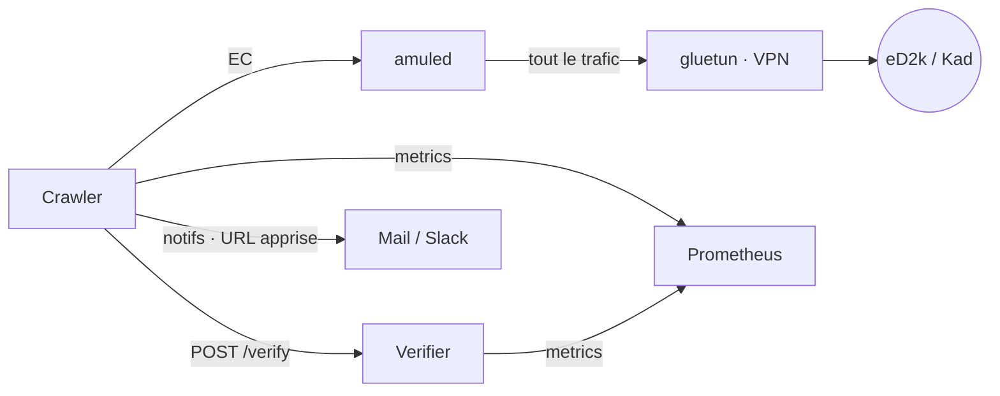
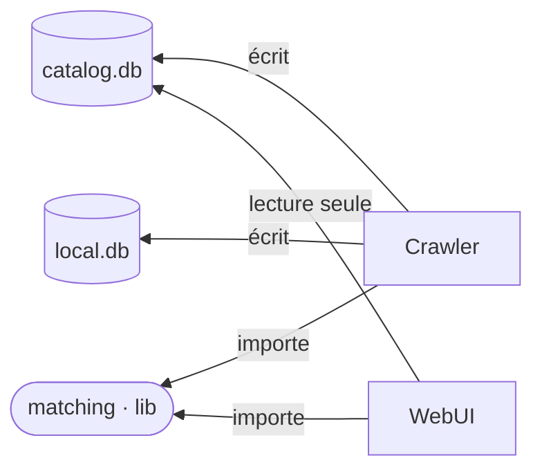
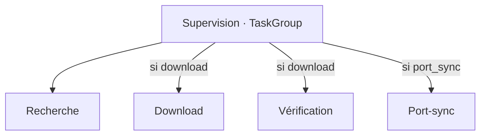
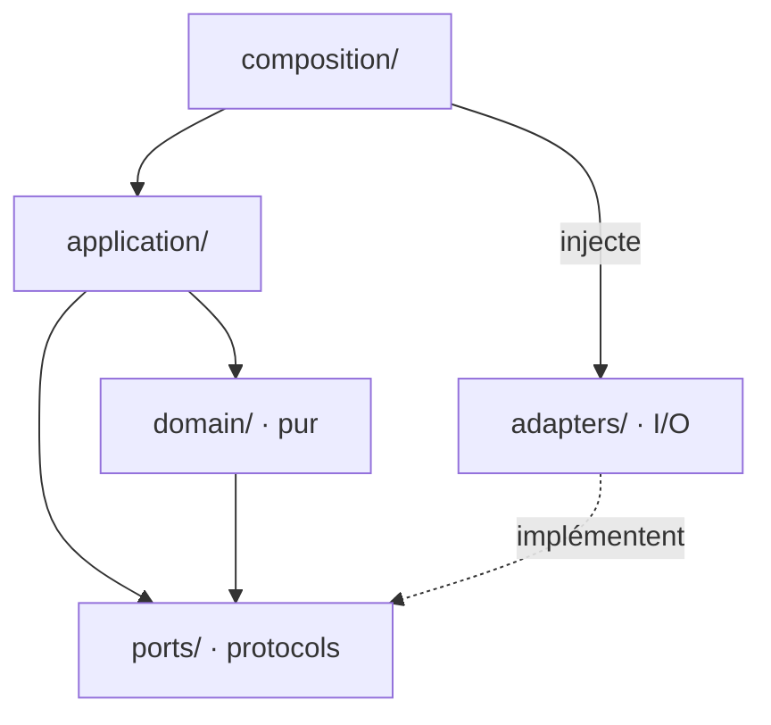
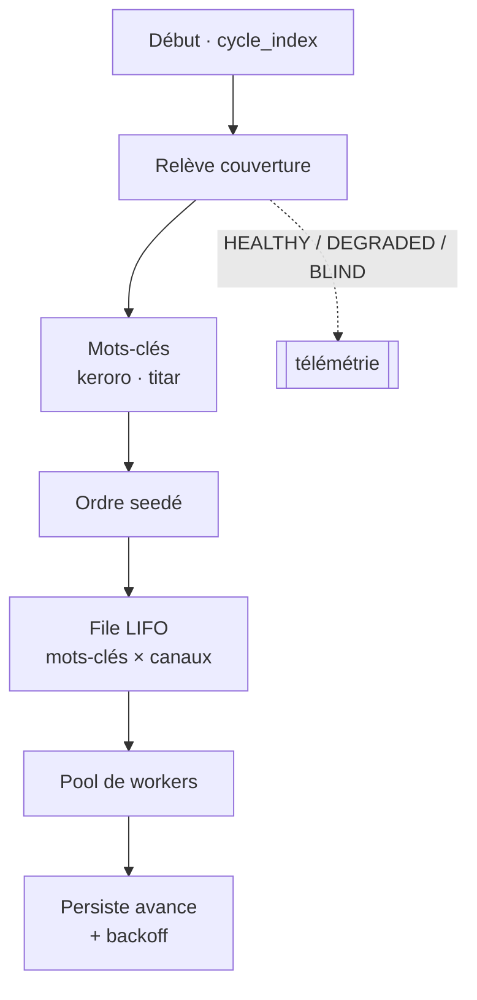
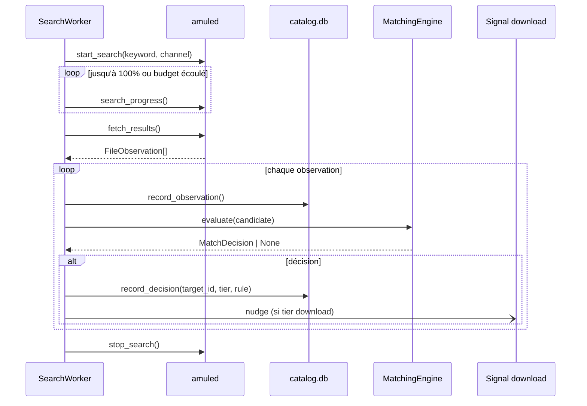
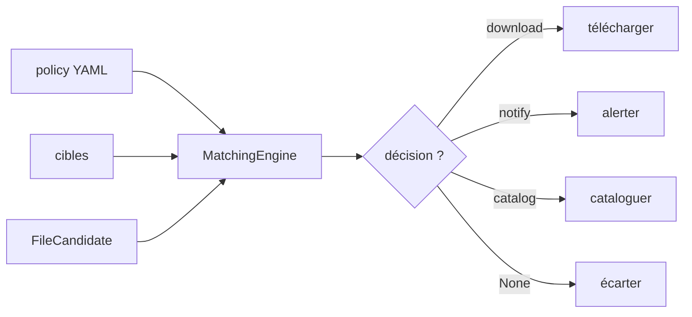
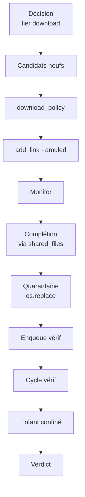
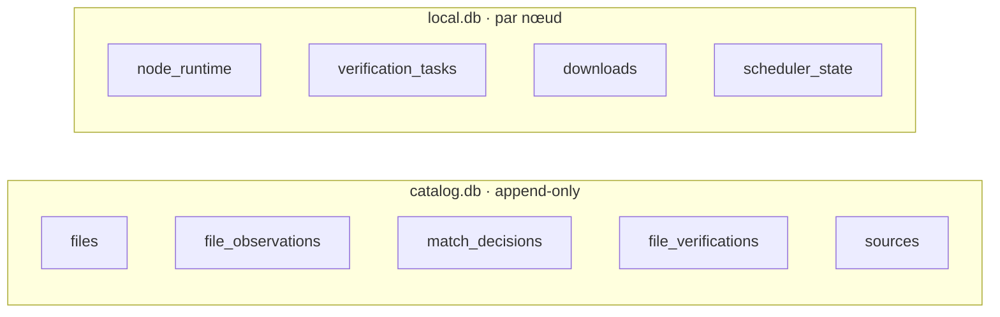
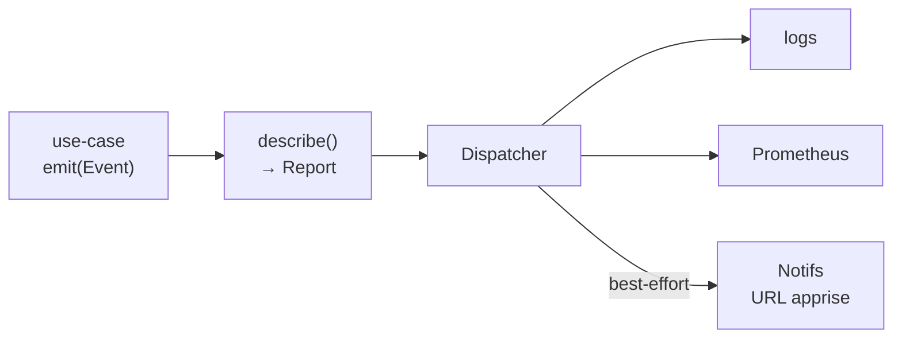

# Architecture & comportement — emule-indexer

> Vue d'ensemble lisible du système : sous-systèmes, interactions, et cycles de vie runtime.
> Pour la **conception détaillée** voir `docs/specs/` (la spec MVP fait foi) ; pour **opérer** un
> nœud voir `docs/runbooks/` ; pour l'**état courant/prochain pas** voir `docs/handoffs/` (le plus
> récent). Ce document décrit *comment ça marche*, pas *comment déployer*.
>
> Ancrage code : la table « Où le code vit » de `CLAUDE.md` donne le fichier de chaque sous-système.

## 1. En une phrase

`emule-indexer` surveille en continu le réseau eMule (eD2k + Kad, via un `amuled` piloté en
protocole **EC**) pour retrouver les épisodes VF perdus de *Keroro mission Titar*, en cataloguant
toute la métadonnée croisée au passage. **Le sujet du catalogue est le fichier, jamais la personne.**

## 2. Vue d'ensemble des sous-systèmes

Un **workspace uv** de quatre paquets, plus des dépendances externes.

**Contexte — le nœud et l'extérieur** (tout le trafic réseau d'`amuled` passe par le VPN) :

**Composants internes & données partagées** (le crawler écrit, le webui lit ; `matching` est une
lib importée) :

| Paquet | Dist | Rôle |
|---|---|---|
| `emule_indexer` | `emule-indexer` | **Crawler** : pilote `amuled` en EC, boucles recherche/download/vérification, persistance, observabilité. |
| `download_verifier` | `download-verifier` | **Verifier** : service HTTP qui analyse un fichier téléchargé dans un process enfant confiné. |
| `catalog_matching` | `catalog-matching` | **Moteur de matching** (lib partagée) : policy déclarative fichier→épisode. Importée par crawler et webui. |
| `catalog_webui` | `catalog-webui` | **WebUI** : lecteur *read-only* du catalogue. |

**Frontières strictes** (invariants) : le crawler n'importe jamais `download_verifier` (il l'appelle
en HTTP) ; le verifier n'importe jamais `emule_indexer` ; seul un test de contrat croise la frontière.

## 3. Deux modes de fonctionnement

Le mode découle **de la config** (`crawler.yml`, section `download`) — pas d'un flag séparé.

- **Observer** (`download` absent/`enabled: false`) : **seule la boucle recherche tourne** — on
  catalogue, on ne télécharge rien.
- **Download** (`download.enabled: true`) : recherche **+** download **+** vérification. Démarrage
  *fail-fast* sur un health-check du verifier.
- **Port-sync** (section `port_sync` présente) : boucle indépendante, orthogonale au mode, pour tenir
  le **High-ID** derrière le VPN (voir §9).

Chaque boucle est une itération suivie d'un sommeil (`*_interval_seconds` de config), supervisée par
un `TaskGroup` : une boucle qui plante loudly annule les sœurs (fail-fast), mais les erreurs d'I/O
*attendues* sont absorbées à l'intérieur d'un cycle (voir §10, discipline de frontière).

## 4. Architecture interne du crawler (Clean / Hexagonal)

Le graphe de dépendances est un DAG orienté vers le **domaine pur**.

- **`domain/`** est **pur** : aucune I/O, pas de `yaml`/DB/réseau/horloge/logging, pas de lecture
  d'env. L'interpolation `${VAR}` de `crawler.yml` est résolue par l'adapter config **avant** que
  quoi que ce soit n'atteigne le domaine.
- **`application/`** orchestre les use-cases async en parlant à des **ports** (protocols).
- **`adapters/`** portent toute l'I/O et implémentent les ports structurellement.
- **`composition/`** (`CrawlerApp`, `python -m emule_indexer`) charge la config, valide *fail-fast*,
  câble les adapters concrets, et supervise les boucles.

## 5. Le cycle de recherche

C'est le cœur du système en mode observer, et sa raison d'être : **être présent 24/7** pour attraper
un fichier rare à l'instant où une source le partage. Un cycle balaie tous les mots-clés sur tous les
canaux et toutes les instances `amuled`.

Points clés du parcours :

- **Deux canaux** par mot-clé : `SearchChannel.GLOBAL` (eD2k multi-serveurs) et `SearchChannel.KAD`.
  Une tâche = *(mot-clé, canal)*.
- **Mots-clés minimaux, issus de config** : `search.keywords` (défaut `keroro` + `titar`). `keroro`
  ratisse large ; `titar` est une **sentinelle FR** rare, non-saturable (voir le handoff
  simplification recherche pour le *pourquoi* — la donnée réelle a montré que chercher plus n'aide
  pas). La génération de mots-clés par cible a été retirée.
- **Ordre seedé par nœud** (`node_id : cycle_index`) : deux nœuds divergent (angles morts temporels
  supprimés), un même nœud rejoue le même ordre à cycle égal.
- **File LIFO + pool de workers** : chaque worker pilote une instance `amuled`. Un worker dont
  l'instance est en **backoff** ré-enfile la tâche *au sommet* pour qu'un **pair** la prenne
  immédiatement (pas de perte, pas de boucle infinie). Si toutes les instances sont en backoff, la
  tâche est *droppée* avec une trace de télémétrie.
- **Couverture ≠ liveness** : « le process vit » n'implique pas « on peut trouver maintenant ». Une
  instance est *search-capable* si HighID eD2k **ou** Kad connecté ; l'agrégat donne
  `HEALTHY / DEGRADED / BLIND`. `BLIND` est loggé fort (edge-triggered, anti-spam).
- **Résilience** : une `RepositoryError` en fin de cycle est absorbée → l'index n'avance pas → le
  cycle est rejoué au tour suivant (état append-only, pas de corruption).

### 5.1 Une tâche de recherche, de bout en bout

- Un résultat EC devient une `FileObservation` via `adapters/mule_ec/mapping.py` (capture-all : le
  hash MD4, le nom, la taille, le nombre de sources, plus tous les tags bruts). **EC n'expose aucune
  métadonnée média sur les résultats de recherche** — durée/codec n'arrivent qu'après download, au
  verifier.
- L'observation est écrite (`files` + `file_observations`) **puis** matchée. La décision
  (`target_id`, `rule_name`, `tier`) va dans `match_decisions`. En mode download, un tier `download`
  *nudge* la boucle download pour qu'elle réagisse sans attendre son intervalle.
- Un échec applicatif EC (`EC_OP_FAILED`) met le **canal** de cette instance en **backoff** (base ×
  facteur^échecs + jitter), persisté en fin de cycle.

## 6. Du fichier à la décision — le moteur de matching

Depuis que la recherche est « bête » (2 mots-clés), **c'est le matcher qui porte toute la
précision**. C'est un **moteur fixe minimal + une policy 100 % en YAML** (données validées
*fail-fast*, pas de code par cible).

- **Deux natures de tokens** : *identifiants d'épisode* (spécifiques à la cible : numéro de segment,
  couverture de titre) vs *marqueurs de source* (agnostiques : `teletoon`, `idf1`, `vf`). Un marqueur
  seul n'identifie aucun épisode → il ne fait qu'**upgrader** une identification faible
  (`notify → download`), jamais la porter seul.
- **Gardes universelles** : `is_keroro` (franchise **et** non-étranger) préfixe chaque règle ;
  `is_episode` (= `is_keroro` **et** pas un clip) préfixe chaque règle *actionnable*. L'anti-match
  `foreign_lang` vit **dans** `is_keroro`, donc un fichier étranger est **écarté**, pas catalogué.
- **Format à trois voies** : vidéo → tiers actionnables ; archive → `notify` (revue) ; le reste
  (mp3, pdf…) → seulement le catalogue permissif (invariant « cataloguer toute la métadonnée »).
- **Décision déterministe** : parmi toutes les règles qui matchent (sur toutes les cibles), on prend
  le **tier le plus haut** (`download > notify > catalog`), départage par index de règle puis
  `target_id`. L'explication est *retournée* (pour le webui), jamais loggée.

## 7. Download → complétion → quarantaine → vérification

Actif seulement en mode download. Une itération de `run_download_cycle` enchaîne quatre étapes ; la
vérification est une boucle consommatrice séparée.

Invariants porteurs (à ne pas violer) :

- **Le crawler PROD ne lit jamais les octets téléchargés.** La complétion est un **signal positif**
  (le fichier apparaît dans la liste des partagés d'`amuled`), jamais une inférence sur le contenu.
- La promotion en quarantaine est un **`os.replace` seul** (déplacement atomique, anti-traversal sur
  le basename). Les octets ne sont lus **que** dans l'enfant jetable du verifier.
- La `download_policy` est conservatrice : skip si `tier ≠ download`, si la cible est `complete`, si
  le hash est déjà téléchargé (dédup), ou si le plafond disque serait dépassé. Un épisode déjà
  `found` **se re-télécharge** quand un *nouveau* hash le matche (redondance d'archivage voulue).

### 7.1 Le service verifier

Un service Starlette **isolé** (`packages/verifier/`), appelé en HTTP :

- `POST /verify` `{hash, expected}` → `{verdict, real_meta, checks}` ; `GET /health` (liveness, le
  crawler fail-fast au démarrage) ; `GET /metrics` (Prometheus).
- Chaque fichier est analysé dans un **process enfant confiné** (rlimits + seccomp blocklist +
  timeout, tempdir, refus des symlinks). Les checks : `type_sniff` (puremagic), `ffprobe`
  (durée/codec/bitrate), et `clamav` optionnel. Le verdict est le **pire-cas** des checks.
- Posture de confinement : le plancher portable est le durcissement conteneur (`cap_drop: ALL`,
  `no-new-privileges`, `read_only`, réseau `internal`) + seccomp par enfant + rlimits (voir la spec
  ring-noyau et l'administration runbook).

## 8. Persistance — deux bases, deux rôles

- **`catalog.db`** : le savoir accumulé, **append-only** (triggers `BEFORE UPDATE/DELETE → ABORT`),
  donc N nœuds → 1 catalogue par fusion (`python -m emule_indexer.merge`). Les insertions sont
  **idempotentes** (`INSERT OR IGNORE` / `ON CONFLICT DO NOTHING`) → sûres à un redémarrage mi-écriture.
- **`local.db`** : l'état runtime du nœud (identité, file de vérification avec bail, suivi des
  downloads, avance du scheduler + backoff). **Jamais fusionné** — propre à chaque nœud.

## 9. Port-sync High-ID (optionnel)

Derrière un VPN, le port entrant change ; sans High-ID, la connectabilité (et donc la couverture)
se dégrade. La boucle port-sync : lit le **port forwardé vivant** de gluetun → si différent du port
d'`amuled`, appelle `set_listen_port` en EC → **redémarre** le conteneur `amuled` pour re-binder →
re-vérifie le High-ID. Rate-limité (≤ 1 restart / fenêtre) ; si le port reste faux, alerte
edge-triggered (audience OPERATIONS). *Risque assumé : High-ID augmente l'exposition — voir
administration runbook.*

## 10. Observabilité

Le **domaine** émet des `Event` purs ; une **policy** pure (`describe`) les route en `Report`
(sévérité de log + instructions de métrique + audiences COMMUNITY/OPERATIONS) ; l'**adapter**
dispatcher applique. **Discipline de frontière (E-D13)** : les pannes de notifieur (apprise) ou du
verifier sont **absorbées** (dégradation) ; un échec d'un composant 100 %-testé en process (ex.
`PrometheusSink`) **crash loudly** — c'est un bug, pas un aléa transitoire.

## 11. Invariants de conception (récapitulatif)

- **Le sujet du catalogue est le fichier, jamais la personne** — pas de tracking, pas de
  déanonymisation.
- **Le crawler PROD ne lit jamais les octets** ; complétion = signal positif ; promotion = `os.replace`.
- **Frontières de paquets** : crawler ⇏ verifier, verifier ⇏ crawler (seul le test de contrat croise).
- **Deux modes** pilotés par la config (observer / download).
- **Policy de matching 100 % en YAML** ; le moteur reste fixe et minimal.
- **`domain/` pur** ; toute l'I/O dans `adapters/` ; le graphe de dépendances est un DAG.
- **`catalog.db` append-only et fusionnable ; `local.db` jamais fusionné.**
- **Discipline de frontière** : absorber l'I/O externe attendue, laisser crasher le code interne testé.

## 12. Repères de code

| Sous-système | Emplacement (sous `packages/crawler/src/emule_indexer/` sauf mention) |
|---|---|
| Boucles & câblage | `composition/app.py` (`CrawlerApp`), `python -m emule_indexer` |
| Use-cases | `application/run_search_cycle.py`, `run_download_cycle.py`, `run_verification_cycle.py`, `port_sync_loop.py` |
| Recherche (pur) | `domain/search/` (`keywords`, `cycle`, `backoff`, `coverage`) |
| Matching | `packages/matching/src/catalog_matching/` (moteur + policy `deploy/config/crawler/matcher.yml`) |
| Frontière EC | `adapters/mule_ec/` (codec / transport / client) ; ports `ports/mule_client.py`, `ports/mule_download_client.py` |
| Persistance | `adapters/persistence_sqlite/` (`.sql` migrations, repos) |
| Observabilité | `domain/observability/`, `adapters/observability/` |
| Verifier | `packages/verifier/src/download_verifier/` (`app.py`, `check.py`, `checks/`) |
| WebUI | `packages/webui/src/catalog_webui/` |
