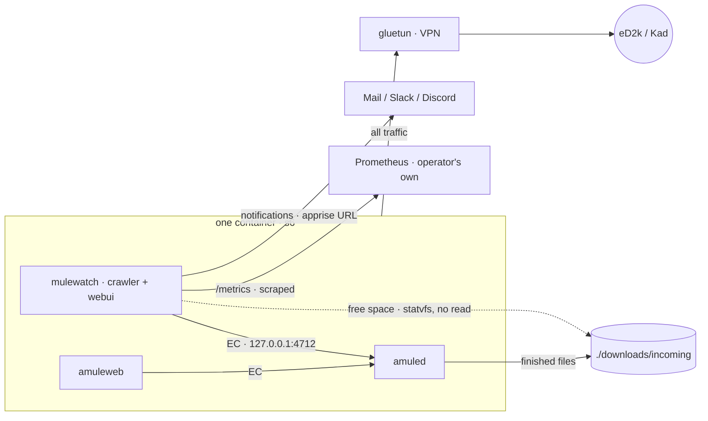
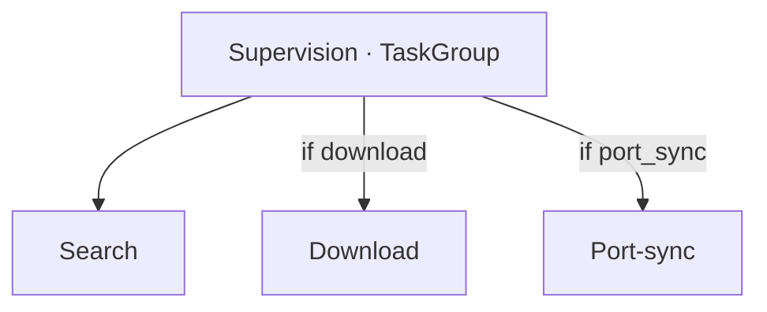
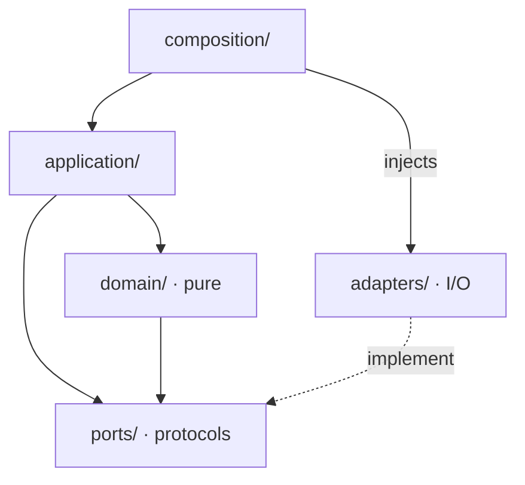
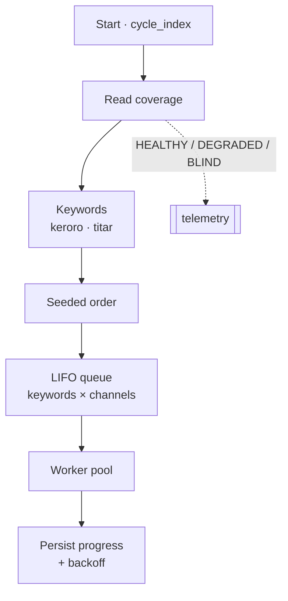
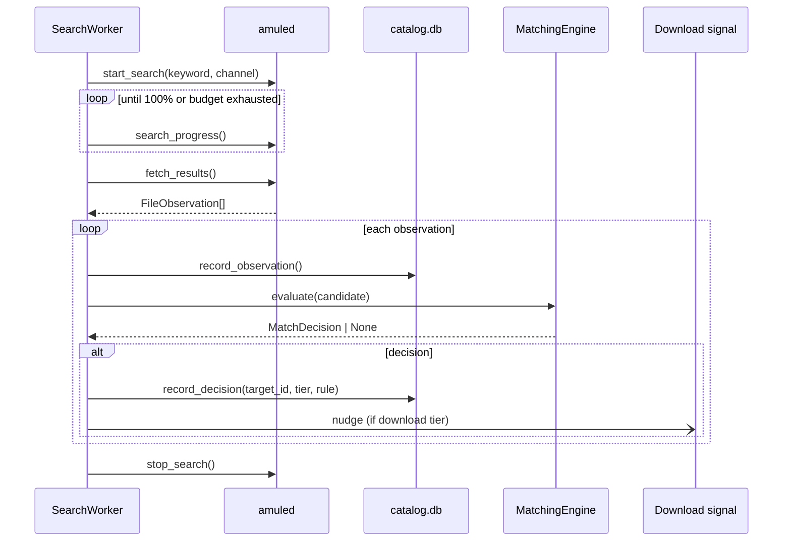
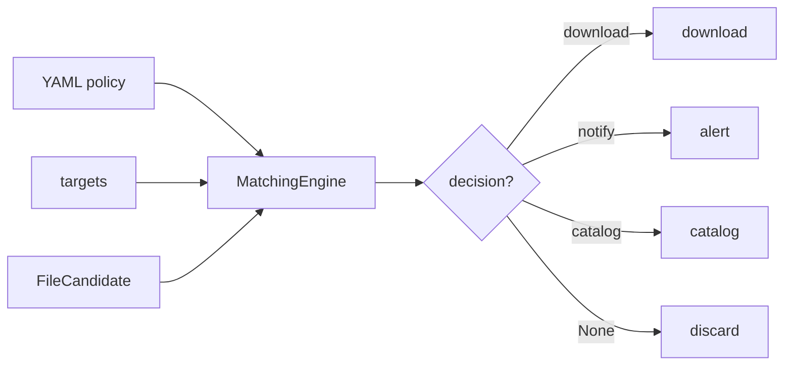
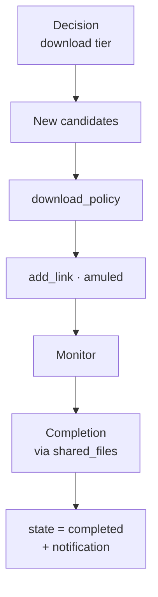
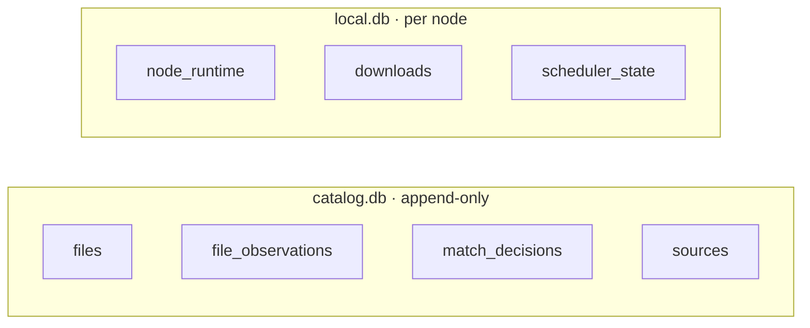
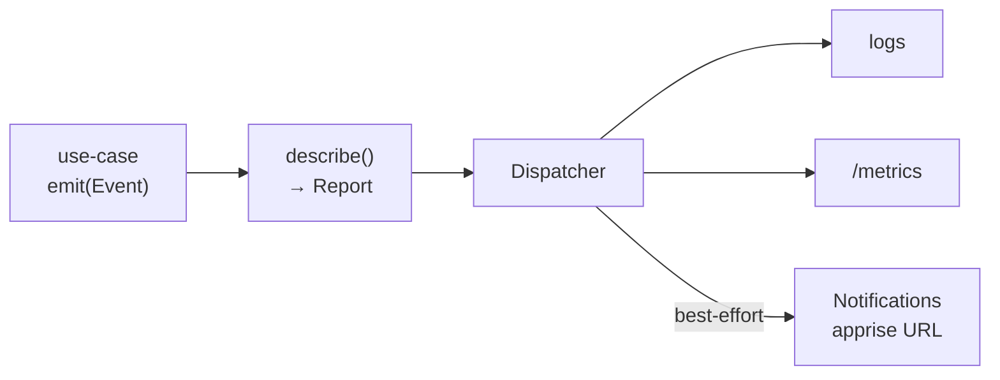

# Architecture and behaviour: mulewatch

> A readable overview of the system: subsystems, interactions, and runtime lifecycles.
> For the **detailed design** see `agents/specs/` (the MVP spec is authoritative); to **operate** a
> node see `docs/runbooks/`; for the **current state and next step** see `agents/handoffs/` (the most
> recent one). This document describes *how it works*, not *how to deploy it*.
>
> Code anchor: the "Where the code lives" table in `AGENTS.md` gives the file for each subsystem.

## 1. In one sentence

`mulewatch` continuously watches the eMule network (eD2k + Kad, through an `amuled` driven over the
**EC** protocol) to recover the lost French-dub episodes of *Keroro mission Titar*, cataloguing
every piece of metadata it crosses along the way. **The catalog's subject is the file, never the
person.**

## 2. Subsystem overview

A **uv workspace** of three packages, plus external dependencies.

**Context: the node and the outside world.** Since 2026-09-16 a node is **one container**: the
crawler, `amuled` and `amuleweb` are three processes of one image, supervised by **s6** (`s6-svscan`
is PID 1). Under the VPN stack that whole container shares gluetun's network namespace, so all of
its traffic goes through the tunnel.

Consequences of that shape, each load-bearing elsewhere in this document:

- **The EC endpoint is a code constant** (`127.0.0.1:4712`, instance name `amuled`), like the webui's
  `0.0.0.0:8080` bind. `crawler.yml` configures only the password, from `${AMULE_EC_PASSWORD}`.
- **Restarting `amuled` is `s6-svc -r`**, a local process restart, not a container restart (§9).
- **The three processes start at once**, so the crawler routinely reaches EC before `amuled`
  listens; "daemon unreachable at startup" is tolerated and absorbed by the backoff.
- **PID 1 is root** (it creates the `amule` user from `PUID`/`PGID` and takes the bind mounts), then
  every service drops privileges with `setpriv`. `user:`, `read_only:` and `cap_drop: ALL` therefore
  no longer apply to the shipped service; `no-new-privileges`, `pids_limit` and `mem_limit` remain.
- **A non-zero crawler exit kills the container** (its s6 `finish` runs `s6-svscanctl -t`), so an
  invalid config shows up as a visible restart loop. A clean exit — the webui's restart control —
  brings the crawler back alone, and `amuled` keeps its eD2k and Kad sessions.

No Prometheus or Grafana container ships with the stack: the crawler exposes `/metrics` and an
operator who wants dashboards points their own Prometheus at it.

**Internal components and shared data** (the crawler writes, the webui reads; `matching` is an
imported library):

| Package | Dist | Role |
|---|---|---|
| `mulewatch` | `mulewatch` | **Crawler**: drives `amuled` over EC, runs the search and download loops, persistence, observability. Contains the in-process webui subpackage `mulewatch.webui` (read-only catalog viewer). |
| `catalog_matching` | `catalog-matching` | **Matching engine** (shared library): declarative file to episode policy. Imported by the crawler and by the webui. |
| `vex_guards` | `vex-guards` | **Dev/CI tooling**: keeps our OpenVEX claims honest. Never shipped in a prod image. |

**Strict boundaries** (invariants): `catalog_matching` is pure and never imports `mulewatch`;
`vex_guards` is never imported by shipped code.

## 3. Two run modes, one topology

The mode follows **from the config** (`crawler.yml`, `download` section), not from a separate flag
and not from a compose profile. Both compose stacks assemble the same services either way.

- **Download** (`download.enabled: true`, the shipped default): search **plus** download.
- **Catalog only** (`download` absent or `enabled: false`): **only the search loop runs**. The node
  catalogues and notifies, and downloads nothing.
- **Port-sync** (`port_sync` section present and enabled): an independent loop, orthogonal to the
  mode, that holds the **High-ID** behind the VPN (see §9).

Each loop is one iteration followed by a sleep (`*_interval_seconds` from the config), supervised by
a `TaskGroup`: a loop that crashes loudly cancels its siblings (fail-fast), but *expected* I/O
errors are absorbed inside a cycle (see §10, boundary discipline).

## 4. Internal architecture of the crawler (Clean / Hexagonal)

The dependency graph is a DAG pointing at the **pure domain**.

- **`domain/`** is **pure**: no I/O, no `yaml`/DB/network/clock/logging, no env reads. The `${VAR}`
  interpolation in `crawler.yml` is resolved by the config adapter **before** anything reaches the
  domain.
- **`application/`** orchestrates the async use-cases by talking to **ports** (protocols).
- **`adapters/`** carry all the I/O and satisfy the ports structurally.
- **`composition/`** (`CrawlerApp`, `python -m mulewatch`) loads the config, validates it
  *fail-fast*, wires the concrete adapters, and supervises the loops.

## 5. The search cycle

This is the heart of the system and its reason to exist: **being there 24/7** to catch a rare file
the instant a source shares it. One cycle sweeps every keyword over every channel.

Key points along the way:

- **Two channels** per keyword: `SearchChannel.GLOBAL` (multi-server eD2k) and `SearchChannel.KAD`.
  One task = *(keyword, channel)*.
- **Minimal keywords, from config**: `search.keywords` (default `keroro` + `titar`). `keroro` casts
  a wide net; `titar` is a rare, non-saturable **French sentinel** (see the search-simplification
  handoff for the *why*: real data showed that searching more does not help). Per-target keyword
  generation was removed.
- **Per-node seeded order** (`node_id : cycle_index`): two nodes diverge (no shared temporal blind
  spots), while a single node replays the same order for the same cycle.
- **LIFO queue + one worker**: the container holds exactly one `amuled`, so the pool that used to
  spread tasks over several daemons collapsed onto a single worker (2026-09-16). The machinery is
  unchanged — a worker whose daemon is in **backoff** re-queues the task *on top* for a peer — but
  with no peer left, a task hitting backoff is *dropped* with a telemetry trace and replayed next
  cycle. Multi-node redundancy is now entirely a matter of running several nodes and merging their
  catalogs.
- **Coverage is not liveness**: "the process is alive" does not imply "we can find something right
  now". The daemon is *search-capable* if it has an eD2k HighID **or** is connected to Kad; that
  yields `HEALTHY / DEGRADED / BLIND`. `BLIND` is logged loudly (edge-triggered, anti-spam).
- **Resilience**: a `RepositoryError` at the end of a cycle is absorbed, the index does not advance,
  and the cycle is replayed next round (append-only state, no corruption).

### 5.1 One search task, end to end

- An EC result becomes a `FileObservation` through `adapters/mule_ec/mapping.py` (capture-all: the
  MD4 hash, the name, the size, the source count, plus every raw tag). **EC exposes no media
  metadata on search results**: there is no duration, codec or bitrate anywhere, and since content
  verification left the scope nothing downstream supplies it either. The catalog therefore holds
  exactly what eD2k search reports.
- The observation is written (`files` + `file_observations`) **then** matched. The decision
  (`target_id`, `rule_name`, `tier`) goes into `match_decisions`. In download mode, a `download`
  tier *nudges* the download loop so it reacts without waiting for its interval.
- An EC application failure (`EC_OP_FAILED`) puts that **channel** into **backoff** (base
  × factor^failures + jitter), persisted at the end of the cycle.

## 6. From file to decision: the matching engine

Now that the search is "dumb" (2 keywords), **the matcher carries all the precision**. It is a
**minimal fixed engine plus a 100 % YAML policy** (data validated *fail-fast*, no per-target code).

- **Two natures of tokens**: *episode identifiers* (target-specific: segment number, title coverage)
  versus *source markers* (agnostic: `teletoon`, `idf1`, `vf`). A marker alone identifies no
  episode, so it only **upgrades** a weak identification (`notify -> download`), never carries one
  on its own.
- **Universal guards**: `is_keroro` (franchise **and** not foreign) prefixes every rule;
  `is_episode` (= `is_keroro` **and** not a clip) prefixes every *actionable* rule. The anti-match
  `foreign_lang` lives **inside** `is_keroro`, so a foreign file is **discarded**, not catalogued.
- **Three-way format split**: video gets the actionable tiers; an archive gets `notify` (for review);
  everything else (mp3, pdf and so on) gets only the permissive catalog tier (the "catalog every
  piece of metadata" invariant).
- **Deterministic decision**: among every rule that matches (across every target), take the
  **highest tier** (`download > notify > catalog`), broken by rule index then `target_id`. The
  explanation is *returned* (for the webui), never logged.

## 7. Download to completion

Active in download mode only. One iteration of `run_download_cycle` chains three steps over a single
EC connection.

Load-bearing invariants (do not violate):

- **The crawler PROD never reads the downloaded bytes, and never touches the output directory at
  all.** Completion is a **positive signal**: the hash appears in `amuled`'s shared-files list
  **and** has left the download queue (amuled shares partial downloads too, so the queue is what
  separates a completion from a partial). It is never an inference about the content.
- **Nothing moves the finished file.** amuled writes straight into its own `IncomingDir`,
  bind-mounted to `./downloads/incoming` on the host; the crawler records the state change and
  notifies, nothing more.
- **Nothing inspects the file.** There is no type sniffing, no `ffprobe`, no antivirus scan: since
  the scope reduction of 2026-09-13, judging whether a completed download really is the episode is a
  manual step performed by the operator on the output directory.
- `download_policy` is conservative: skip if `tier != download`, if the target is `complete`, if the
  hash was already downloaded (dedup), or if admitting the file would break the disk floor. An
  episode already `found` **is downloaded again** when a *new* hash matches it (deliberate archival
  redundancy).
- The disk floor (`download.min_free_bytes`) is **measured, not accounted** (2026-09-13): a candidate
  is admitted only when `free - outstanding - size >= min_free`, where `free` is one
  `shutil.disk_usage` call on `download.output_dir` and `outstanding` is what amuled's queue still
  has to transfer, taken from the cycle's existing queue snapshot. The output directory is now
  mounted **read-write** — `amuled` shares the container and writes into it — but the crawler still
  never opens a file there: `statvfs` reads filesystem metadata, never bytes. The host's
  `./downloads` is bound **whole**, not as its two subdirectories, precisely so that this `statvfs`
  measures the filesystem that fills up rather than the container's writable layer.
  Free space alone would be wrong, since the filesystem knows nothing of the bytes still coming.
- **A download amuled no longer knows becomes `failed`** after `download.lost_after_seconds`
  (default 24 h). Every cycle stamps `last_seen_at` for each hash present in amuled's queue **or**
  its shared files, and a `queued`/`downloading` row older than the TTL is condemned. This is safe
  because an entry stays in amuled's queue even with zero sources: absence really means gone.
  amuled stays the authority, so a `failed` row that reappears in the queue resumes `downloading`,
  and one that appears in the shared files completes and notifies.
- The floor never deletes anything, and `is_downloaded()` stays state-blind: a `failed` row keeps
  blocking automatic re-queuing, so completed files still accumulate without bound and a manual
  retry means deleting the row.

`DownloadState` is a closed enum: `queued -> downloading -> completed`, or `failed`. `completed` is
terminal; `failed` is terminal only until amuled says otherwise.

## 8. Persistence: two databases, two roles

- **`catalog.db`** (schema version 5): the accumulated knowledge, **append-only** (`BEFORE
  UPDATE/DELETE -> ABORT` triggers), so N nodes merge into one catalog (`python -m
  mulewatch.merge`). Inserts are **idempotent** (`INSERT OR IGNORE` / `ON CONFLICT DO NOTHING`), so
  they are safe across a restart mid-write.
- **`local.db`** (schema version 5): the node's runtime state (identity, download tracking, the
  scheduler's progress and backoff). **Never merged**: it belongs to one node.

Migration `catalog/0005` dropped `file_verifications` and `local/0004` dropped `verification_tasks`,
rewriting any surviving `quarantined` download row to `completed` (that value left `DownloadState`,
and reading it back would raise). `local/0005` added `downloads.last_seen_at`, backfilled with
`queued_at` so no pre-upgrade row is condemned on first boot.

## 9. High-ID port-sync (optional)

Behind a VPN the inbound port changes; without a High-ID, connectability (and therefore coverage)
degrades. The port-sync loop reads gluetun's **live forwarded port**, and if it differs from
`amuled`'s port calls `set_listen_port` over EC, then **restarts the `amuled` process** so it
rebinds, then re-checks the High-ID. It is rate-limited (at most one restart per window); if the
port stays wrong, an edge-triggered alert fires (OPERATIONS audience). *Accepted risk: a High-ID
increases exposure, see the administration runbook.*

Since 2026-09-16 that restart is a local `s6-svc -r /etc/services.d/amuled` (`S6MuleRestarter`), run
in the container the crawler already lives in. The Docker socket, its confined proxy service and the
`HttpMuleRestarter` are gone. This is also the more correct shape: the listen port was never
re-bindable at runtime, so port-sync always needed a *process* restart — it restarted a *container*
only because the process was out of reach.

## 10. Observability

The **domain** emits pure `Event`s; a pure **policy** (`describe`) routes them into `Report`s (log
severity + metric instructions + COMMUNITY/OPERATIONS audiences); the **adapter** dispatcher applies
them. The Prometheus endpoint is served by the crawler itself on `observability.metrics.port`
(default `9090`); nothing scrapes it out of the box, so publish that port and point your own
Prometheus at it if you want dashboards.

**Boundary discipline (E-D13)**: notifier failures (apprise) and EC failures are **absorbed**
(degradation); a failure in a 100 %-tested in-process component (for instance `PrometheusSink`)
**crashes loudly**, because that is a bug, not a transient.

## 11. Design invariants (recap)

- **The catalog's subject is the file, never the person**: no tracking, no deanonymization.
- **The crawler PROD never reads the bytes and never touches the output directory**; completion is a
  positive signal.
- **Package boundaries**: `catalog_matching` never imports `mulewatch`; `vex_guards` is never
  imported by shipped code.
- **Two run modes** driven by the config (download / catalog-only), one compose topology.
- **Matching policy 100 % in YAML**; the engine stays fixed and minimal.
- **`domain/` is pure**; all the I/O lives in `adapters/`; the dependency graph is a DAG.
- **`catalog.db` is append-only and mergeable; `local.db` is never merged.**
- **Boundary discipline**: absorb expected external I/O failures, let tested internal code crash.

## 12. Code landmarks

| Subsystem | Location (under `packages/crawler/src/mulewatch/` unless noted) |
|---|---|
| Loops and wiring | `composition/app.py` (`CrawlerApp`), `python -m mulewatch` |
| Use-cases | `application/run_search_cycle.py`, `run_download_cycle.py`, `port_sync_loop.py` |
| Search (pure) | `domain/search/` (`keywords`, `cycle`, `backoff`, `coverage`) |
| Matching | `packages/matching/src/catalog_matching/` (engine + policy `deploy/matcher.yml`) |
| EC boundary | `adapters/mule_ec/` (codec / transport / client); ports `ports/mule_client.py`, `ports/mule_download_client.py` |
| Persistence | `adapters/persistence_sqlite/` (`.sql` migrations, repos) |
| Observability | `domain/observability/`, `adapters/observability/` |
| WebUI | `webui/` (in-process, own thread) |
