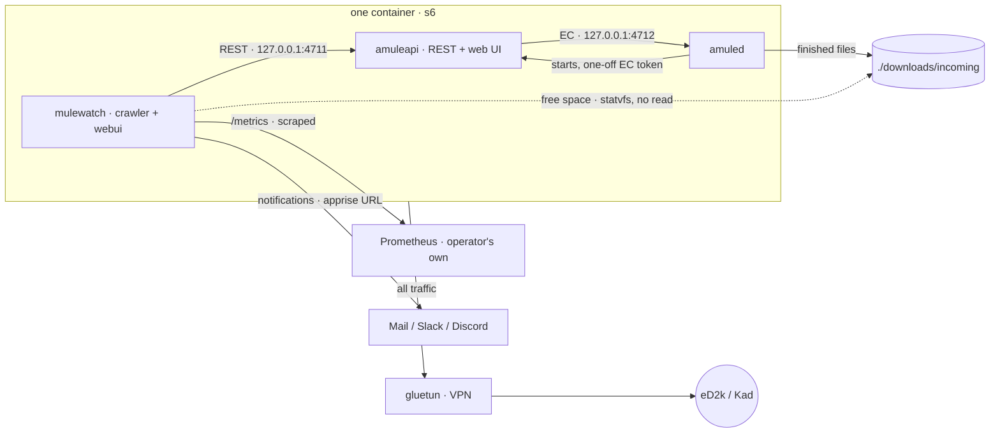
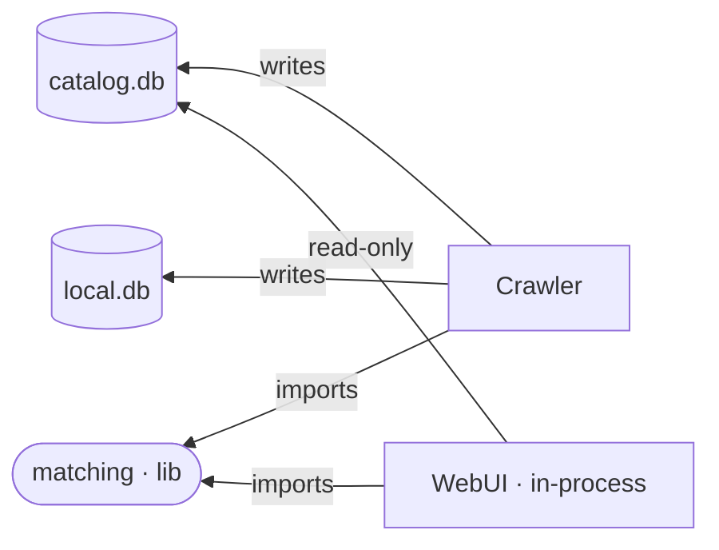
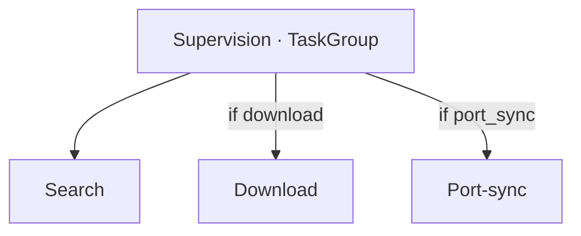
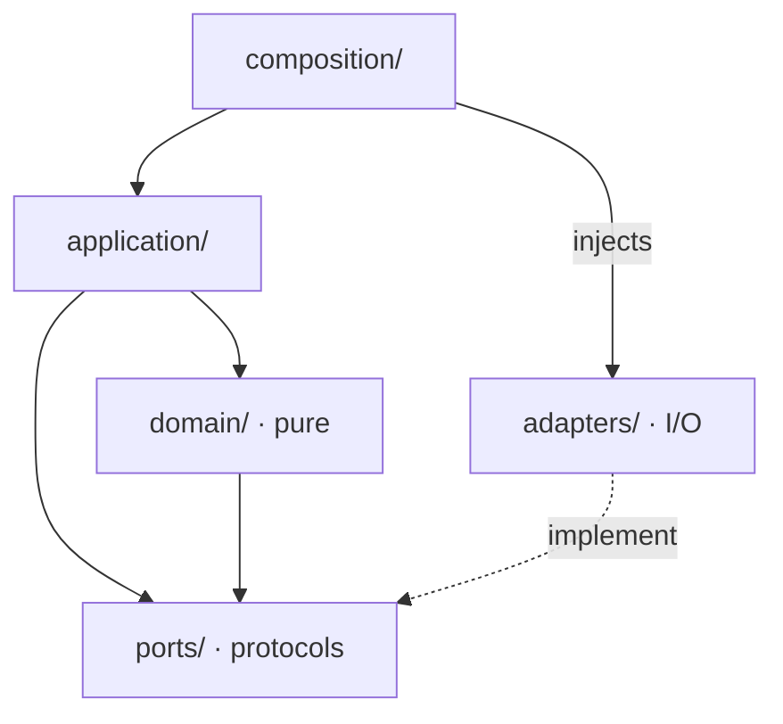
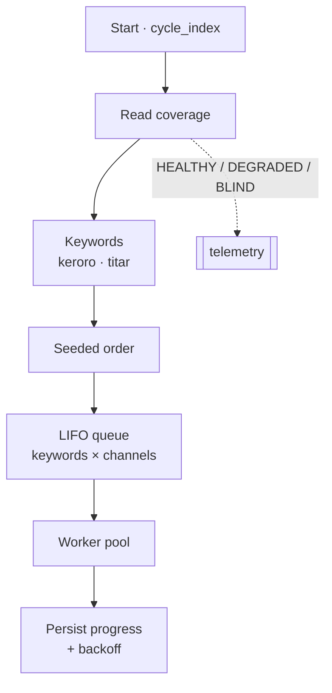
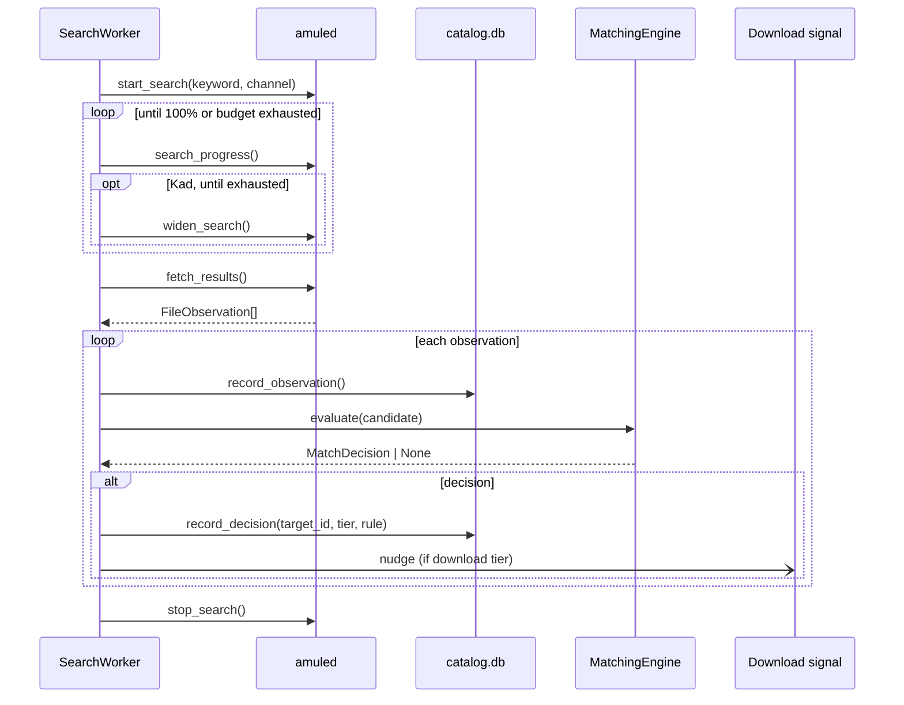
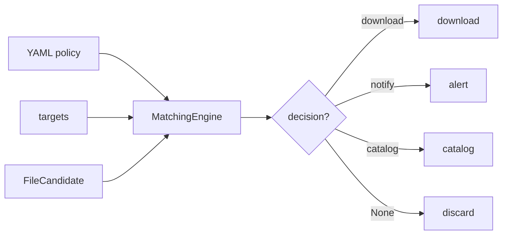
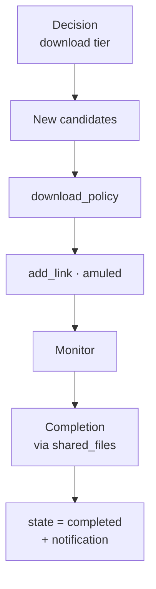
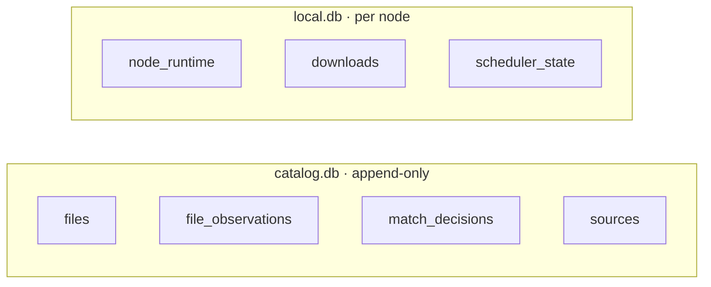
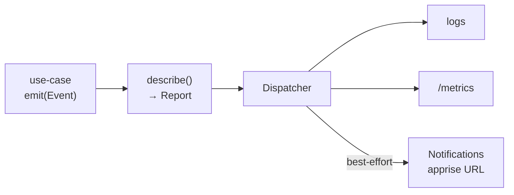

# Architecture et comportement : mulewatch

> Une vue d'ensemble lisible du système : sous-systèmes, interactions et cycles de vie à l'exécution.
> Pour la **conception détaillée**, voir `agents/specs/` (la spec du MVP fait autorité) ; pour
> **exploiter** un nœud, voir [Faire tourner un nœud](../operate.md) ; pour l'**état courant et la prochaine étape**, voir
> `agents/handoffs/` (le plus récent). Ce document décrit *comment ça marche*, pas *comment le
> déployer*.
>
> Ancre de code : le tableau « Where the code lives » d'`AGENTS.md` donne le fichier de chaque
> sous-système.

## 1. En une phrase

`mulewatch` surveille en continu le réseau eMule (eD2k + Kad, via un `amuled` piloté par l'API REST
d'**amuleapi**) pour retrouver les épisodes perdus du doublage français de *Keroro mission Titar*, en
cataloguant au passage chaque métadonnée croisée. **Le sujet du catalogue est le fichier, jamais la
personne.**

## 2. Vue d'ensemble des sous-systèmes

Un **workspace uv** de trois paquets, plus des dépendances externes.

**Contexte : le nœud et le monde extérieur.** Depuis le 2026-09-16, un nœud est **un seul
conteneur** : le crawler, `amuled` et `amuleapi` sont trois processus d'une même image. **s6**
(`s6-svscan` est PID 1) en supervise deux, le crawler et `amuled` ; c'est `amuled` qui démarre
`amuleapi`, et qui l'emporte avec lui en s'arrêtant. Sous la pile VPN, tout ce conteneur partage le
namespace réseau de gluetun, donc tout son trafic passe par le tunnel.



Conséquences de cette forme, chacune porteuse ailleurs dans ce document :

- **Le point d'accès est une constante de code** (`127.0.0.1:4711`, nom d'instance `amuled`),
  comme le bind `0.0.0.0:8080` de la webui. `crawler.yml` ne configure que le mot de passe, depuis
  `${AMULE_API_PASSWORD}` : c'est le mot de passe admin d'amuleapi, le même que celui de son
  interface web. `${AMULE_EC_PASSWORD}` ne sert plus qu'au lien interne amuleapi ↔ amuled.
- **Redémarrer `amuled`, c'est `s6-svc -r`**, un redémarrage de processus local, pas un redémarrage
  de conteneur (§9). `amuleapi` suit, puisque `amuled` le relance.
- **Les processus démarrent en même temps**, donc le crawler frappe couramment à la porte avant
  qu'`amuled` n'ait démarré `amuleapi` ; « démon injoignable au démarrage » est toléré et absorbé
  par le backoff.
- **PID 1 est root** (il crée l'utilisateur `amule` depuis `PUID`/`PGID` et prend les bind mounts),
  puis chaque service abandonne ses privilèges avec `setpriv`. `user:`, `read_only:` et
  `cap_drop: ALL` ne s'appliquent donc plus au service livré ; `no-new-privileges`, `pids_limit` et
  `mem_limit` restent.
- **Une sortie non nulle du crawler tue le conteneur** (son `finish` s6 lance `s6-svscanctl -t`),
  donc une config invalide se voit comme une boucle de redémarrage. Une sortie propre (le contrôle de
  redémarrage de la webui) ramène le crawler seul, et `amuled` garde ses sessions eD2k et Kad.

Aucun conteneur Prometheus ou Grafana n'est livré avec la pile : le crawler expose `/metrics` et un
opérateur qui veut des tableaux de bord y pointe son propre Prometheus.

**Composants internes et données partagées** (le crawler écrit, la webui lit ; `matching` est une
bibliothèque importée) :



| Paquet | Dist | Rôle |
|---|---|---|
| `mulewatch` | `mulewatch` | **Crawler** : pilote `amuled` par amuleapi, fait tourner les boucles de recherche et de téléchargement, la persistance, l'observabilité. Contient le sous-paquet webui in-process `mulewatch.webui` (visualiseur de catalogue en lecture seule). |
| `catalog_matching` | `catalog-matching` | **Moteur de matching** (bibliothèque partagée) : politique déclarative fichier vers épisode. Importé par le crawler et par la webui. |
| `vex_guards` | `vex-guards` | **Outillage dev/CI** : garde honnêtes nos affirmations OpenVEX. Jamais livré dans une image de prod. |

**Frontières strictes** (invariants) : `catalog_matching` est pur et n'importe jamais `mulewatch` ;
`vex_guards` n'est jamais importé par du code livré.

## 3. Deux modes d'exécution, une seule topologie

Le mode découle **de la config** (`crawler.yml`, section `download`), pas d'un flag séparé ni d'un
profil compose. Les deux piles compose assemblent les mêmes services dans les deux cas.



- **Téléchargement** (`download.enabled: true`, le défaut livré) : recherche **plus**
  téléchargement.
- **Catalogue seul** (`download` absent ou `enabled: false`) : **seule la boucle de recherche
  tourne**. Le nœud catalogue et notifie, et ne télécharge rien.
- **Port-sync** (section `port_sync` présente et activée) : une boucle indépendante, orthogonale au
  mode, qui maintient le **High-ID** derrière le VPN (voir §9).

Chaque boucle est une itération suivie d'un sommeil (`*_interval_seconds` depuis la config),
supervisée par un `TaskGroup` : une boucle qui crashe bruyamment annule ses sœurs (fail-fast), mais
les erreurs d'I/O *attendues* sont absorbées à l'intérieur d'un cycle (voir §10, discipline de
frontière).

## 4. Architecture interne du crawler (Clean / Hexagonal)

Le graphe de dépendances est un DAG qui pointe vers le **domaine pur**.



- **`domain/`** est **pur** : pas d'I/O, pas de `yaml`/DB/réseau/horloge/logging, aucune lecture
  d'env. L'interpolation `${VAR}` dans `crawler.yml` est résolue par l'adapter de config **avant**
  que quoi que ce soit n'atteigne le domaine.
- **`application/`** orchestre les cas d'usage asynchrones en parlant à des **ports** (protocoles).
- **`adapters/`** portent toutes les I/O et satisfont les ports structurellement.
- **`composition/`** (`CrawlerApp`, `python -m mulewatch`) charge la config, la valide *fail-fast*,
  câble les adapters concrets et supervise les boucles.

## 5. Le cycle de recherche

C'est le cœur du système et sa raison d'être : **être là 24/7** pour attraper un fichier rare à
l'instant où une source le partage. Un cycle balaie chaque mot-clé sur chaque canal.



Points clés en chemin :

- **Deux canaux** par mot-clé : `SearchChannel.GLOBAL` (multi-serveurs eD2k) et `SearchChannel.KAD`.
  Une tâche = *(mot-clé, canal)*.
- **Mots-clés minimaux, depuis la config** : `search.keywords` (défaut `keroro` + `titar`). `keroro`
  ratisse large ; `titar` est une **sentinelle française** rare et non saturable (voir le handoff de
  simplification de la recherche pour le *pourquoi* : les données réelles ont montré que chercher
  davantage n'aide pas). La génération de mots-clés par cible a été supprimée.
- **Ordre tiré par nœud** (`node_id : cycle_index`) : deux nœuds divergent (pas d'angles morts
  temporels communs), tandis qu'un même nœud rejoue le même ordre pour le même cycle.
- **File LIFO + un seul worker** : le conteneur ne contient exactement qu'un `amuled`, donc le pool
  qui répartissait autrefois les tâches sur plusieurs démons s'est réduit à un worker unique
  (2026-09-16). La mécanique est inchangée (un worker dont le démon est en **backoff** remet la tâche
  *au sommet* pour un pair) mais, sans pair restant, une tâche qui tombe sur un backoff est
  *abandonnée* avec une trace de télémétrie et rejouée au cycle suivant. La redondance multi-nœuds
  est désormais entièrement affaire de faire tourner plusieurs nœuds et de fusionner leurs
  catalogues.
- **La couverture n'est pas la liveness** : « le processus est vivant » n'implique pas « on peut
  trouver quelque chose là, maintenant ». Le démon est *search-capable* s'il a un HighID eD2k **ou**
  s'il est connecté à Kad ; cela donne `HEALTHY / DEGRADED / BLIND`. `BLIND` est loggé bruyamment
  (déclenché sur front, anti-spam).
- **Résilience** : une `RepositoryError` en fin de cycle est absorbée, l'index n'avance pas, et le
  cycle est rejoué au tour suivant (état append-only, pas de corruption).

### 5.1 Une tâche de recherche, de bout en bout



- Un résultat devient une `FileObservation` via `adapters/mule_api/mapping.py` (capture
  exhaustive : le hash MD4, le nom, la taille, le nombre de sources, plus chaque clé non mappée).
  **La durée, le débit et le codec arrivent maintenant avec le résultat**, quand le serveur qui
  répond les annonce : c'est une déclaration du réseau, jamais une mesure locale, et le champ vaut
  `null` sur la plupart des résultats globaux et Kad. Rien n'ouvre jamais le fichier pour en savoir
  plus. Un fichier annoncé sous plusieurs noms arrive **replié** en un seul résultat ; le mapper le
  redéplie en une observation par nom, comme l'EC en produisait une par entrée.
- Une recherche **Kad** est élargie à chaque tour de sondage à partir du deuxième
  (`POST /search/{id}/more`, le bouton « More » d'aMule) jusqu'à ce que Kad réponde
  `409 kad_more_exhausted`. Au premier tour, Kad n'a encore interrogé personne : relancer
  gaspillerait l'une de ses 4 relances. Un échec de cet appel n'arrête jamais la recherche : on
  cesse simplement de l'élargir.
- L'observation est écrite (`files` + `file_observations`) **puis** matchée. La décision
  (`target_id`, `rule_name`, `tier`) va dans `match_decisions`. En mode téléchargement, un tier
  `download` *pousse* la boucle de téléchargement pour qu'elle réagisse sans attendre son intervalle.
- Une opération que le démon refuse (`400 amuled_rejected`) met ce **canal** en **backoff**
  (base × factor^échecs + jitter), persisté en fin de cycle.

## 6. Du fichier à la décision : le moteur de matching

Maintenant que la recherche est « bête » (2 mots-clés), **c'est le matcher qui porte toute la
précision**. C'est un **moteur fixe minimal plus une politique 100 % YAML** (des données validées
*fail-fast*, pas de code par cible).



- **Deux natures de tokens** : les *identifiants d'épisode* (spécifiques à une cible : numéro de
  segment, couverture du titre) face aux *marqueurs de source* (agnostiques : `teletoon`, `idf1`,
  `vf`). Un marqueur seul n'identifie aucun épisode, donc il ne fait que **rehausser** une
  identification faible (`notify -> download`), il n'en porte jamais une à lui seul.
- **Gardes universelles** : `is_keroro` (franchise **et** pas étranger) préfixe chaque règle ;
  `is_episode` (= `is_keroro` **et** pas un clip) préfixe chaque règle *actionnable*. L'anti-match
  `foreign_lang` vit **à l'intérieur** d'`is_keroro`, donc un fichier étranger est **écarté**, pas
  catalogué.
- **Séparation des formats en trois** : la vidéo obtient les tiers actionnables ; une archive obtient
  `notify` (pour revue) ; tout le reste (mp3, pdf et compagnie) n'obtient que le tier catalogue
  permissif (l'invariant « cataloguer chaque métadonnée »).
- **Décision déterministe** : parmi toutes les règles qui matchent (toutes cibles confondues), prendre
  le **tier le plus haut** (`download > notify > catalog`), départagé par l'index de règle puis le
  `target_id`. L'explication est *retournée* (pour la webui), jamais loggée.

## 7. Du téléchargement à la complétion

Actif en mode téléchargement seulement. Une itération de `run_download_cycle` enchaîne trois étapes
sur une seule session amuleapi.



Invariants porteurs (à ne pas violer) :

- **Le crawler PROD ne lit jamais les octets téléchargés, et ne touche jamais au répertoire de sortie
  du tout.** La complétion est un **signal positif** : le hash apparaît dans la liste des fichiers
  partagés d'`amuled` **et** a quitté la file de téléchargement (amuled partage aussi les
  téléchargements partiels, donc c'est la file qui sépare une complétion d'un partiel). Ce n'est
  jamais une inférence sur le contenu.
- **Rien ne déplace le fichier terminé.** amuled écrit directement dans son propre `IncomingDir`,
  bind-mounté sur `./downloads/incoming` côté hôte ; le crawler enregistre le changement d'état et
  notifie, rien de plus.
- **Rien n'inspecte le fichier.** Il n'y a pas de sniffing de type, pas d'`ffprobe`, pas d'analyse
  antivirus : depuis la réduction de périmètre du 2026-09-13, juger si un téléchargement terminé est
  réellement l'épisode est une étape manuelle effectuée par l'opérateur sur le répertoire de sortie.
- `download_policy` est conservatrice : on saute si `tier != download`, si la cible est `complete`,
  si le hash a déjà été téléchargé (dédup), ou si admettre le fichier casserait le plancher disque.
  Un épisode déjà `found` **est retéléchargé** quand un *nouveau* hash lui correspond (redondance
  d'archivage délibérée).
- Le plancher disque (`download.min_free_bytes`) est **mesuré, pas comptabilisé** (2026-09-13) : un
  candidat n'est admis que quand `free - outstanding - size >= min_free`, où `free` est un seul appel
  `shutil.disk_usage` sur `download.output_dir` et `outstanding` ce qu'il reste à transférer à la
  file d'amuled, pris dans l'instantané de file déjà présent dans le cycle. Le répertoire de sortie
  est désormais monté **en lecture-écriture** (`amuled` partage le conteneur et y écrit) mais le
  crawler n'y ouvre toujours aucun fichier : `statvfs` lit des métadonnées de système de fichiers,
  jamais des octets. Le `./downloads` de l'hôte est monté **en entier**, pas comme ses deux
  sous-répertoires, précisément pour que ce `statvfs` mesure le système de fichiers qui se remplit
  plutôt que la couche inscriptible du conteneur.
  L'espace libre seul serait faux, puisque le système de fichiers ne sait rien des octets encore à
  venir.
- **Un téléchargement qu'amuled ne connaît plus devient `failed`** après
  `download.lost_after_seconds` (24 h par défaut). Chaque cycle estampille `last_seen_at` pour chaque
  hash présent dans la file d'amuled **ou** dans ses fichiers partagés, et une ligne
  `queued`/`downloading` plus vieille que le TTL est condamnée. C'est sûr parce qu'une entrée reste
  dans la file d'amuled même avec zéro source : une absence signifie vraiment disparu. amuled reste
  l'autorité, donc une ligne `failed` qui réapparaît dans la file repasse en `downloading`, et une
  qui apparaît dans les fichiers partagés se complète et notifie.
- Le plancher ne supprime jamais rien, et `is_downloaded()` reste aveugle à l'état : une ligne
  `failed` continue de bloquer la remise en file automatique, donc les fichiers terminés
  s'accumulent toujours sans borne et une nouvelle tentative manuelle passe par la suppression de la
  ligne.

`DownloadState` est une enum fermée : `queued -> downloading -> completed`, ou `failed`. `completed`
est terminal ; `failed` n'est terminal que jusqu'à ce qu'amuled en décide autrement.

## 8. Persistance : deux bases, deux rôles



- **`catalog.db`** (version de schéma 5) : la connaissance accumulée, **append-only** (triggers
  `BEFORE UPDATE/DELETE -> ABORT`), pour que N nœuds fusionnent en un seul catalogue (`python -m
  mulewatch.merge`). Les insertions sont **idempotentes** (`INSERT OR IGNORE` /
  `ON CONFLICT DO NOTHING`), donc sans danger en cas de redémarrage en pleine écriture.
- **`local.db`** (version de schéma 5) : l'état d'exécution du nœud (identité, suivi des
  téléchargements, progression et backoff de l'ordonnanceur). **Jamais fusionnée** : elle appartient
  à un seul nœud.

La migration `catalog/0005` a supprimé `file_verifications` et `local/0004` a supprimé
`verification_tasks`, en réécrivant en `completed` toute ligne de téléchargement `quarantined`
survivante (cette valeur a quitté `DownloadState`, et la relire lèverait une erreur). `local/0005` a
ajouté `downloads.last_seen_at`, rempli avec `queued_at` pour qu'aucune ligne antérieure à la mise à
niveau ne soit condamnée au premier démarrage.

## 9. Port-sync High-ID (optionnel)

Derrière un VPN, le port entrant change ; sans High-ID, la connectabilité (et donc la couverture) se
dégrade. La boucle de port-sync lit le **port forwardé courant** de gluetun et, s'il diffère du port
d'`amuled`, appelle `set_listen_port`, puis **redémarre le processus `amuled`** pour qu'il se
rebinde, puis revérifie le High-ID. Elle est limitée en débit (au plus un redémarrage par fenêtre) ;
si le port reste faux, une alerte déclenchée sur front part (audience OPERATIONS). *Risque accepté :
un High-ID augmente l'exposition, voir [Devenir High-ID](../high-id.md).*

Depuis le 2026-09-16, ce redémarrage est un `s6-svc -r /etc/services.d/amuled` local
(`S6MuleRestarter`), exécuté dans le conteneur où le crawler vit déjà. La socket Docker, son service
proxy confiné et le `HttpMuleRestarter` ont disparu. C'est aussi la forme la plus correcte : le port
d'écoute n'a jamais été rebindable à chaud, donc le port-sync a toujours eu besoin d'un redémarrage
de *processus* ; il redémarrait un *conteneur* uniquement parce que le processus était hors de
portée.

## 10. Observabilité



Le **domaine** émet des `Event` purs ; une **politique** pure (`describe`) les route vers des
`Report` (sévérité de log + instructions de métrique + audiences COMMUNITY/OPERATIONS) ; le
dispatcher **adapter** les applique. Le point d'accès Prometheus est servi par le crawler lui-même
sur `observability.metrics.port` (`9090` par défaut) ; rien ne le scrape par défaut, donc publiez ce
port et pointez-y votre propre Prometheus si vous voulez des tableaux de bord.

**Discipline de frontière (E-D13)** : les échecs de notifieur (apprise) et les échecs d'appel au
démon sont
**absorbés** (dégradation) ; un échec dans un composant in-process testé à 100 % (par exemple
`PrometheusSink`) **crashe bruyamment**, parce que c'est un bug, pas un transitoire.

## 11. Invariants de conception (récapitulatif)

- **Le sujet du catalogue est le fichier, jamais la personne** : pas de pistage, pas de
  désanonymisation.
- **Le crawler PROD ne lit jamais les octets et ne touche jamais au répertoire de sortie** ; la
  complétion est un signal positif.
- **Frontières de paquets** : `catalog_matching` n'importe jamais `mulewatch` ; `vex_guards` n'est
  jamais importé par du code livré.
- **Deux modes d'exécution** pilotés par la config (téléchargement / catalogue seul), une seule
  topologie compose.
- **Politique de matching 100 % en YAML** ; le moteur reste fixe et minimal.
- **`domain/` est pur** ; toutes les I/O vivent dans `adapters/` ; le graphe de dépendances est un
  DAG.
- **`catalog.db` est append-only et fusionnable ; `local.db` n'est jamais fusionnée.**
- **Discipline de frontière** : absorber les échecs d'I/O externes attendus, laisser crasher le code
  interne testé.

## 12. Repères dans le code

| Sous-système | Emplacement (sous `packages/crawler/src/mulewatch/` sauf mention) |
|---|---|
| Boucles et câblage | `composition/app.py` (`CrawlerApp`), `python -m mulewatch` |
| Cas d'usage | `application/run_search_cycle.py`, `run_download_cycle.py`, `port_sync_loop.py` |
| Recherche (pure) | `domain/search/` (`keywords`, `cycle`, `backoff`, `coverage`) |
| Matching | `packages/matching/src/catalog_matching/` (moteur + politique `deploy/matcher.yml`) |
| Frontière amuleapi | `adapters/mule_api/` (client / mapping / erreurs) ; ports `ports/mule_client.py`, `ports/mule_download_client.py` |
| Persistance | `adapters/persistence_sqlite/` (migrations `.sql`, repos) |
| Observabilité | `domain/observability/`, `adapters/observability/` |
| WebUI | `webui/` (in-process, thread dédié) |

## 13. Le healthcheck lit la sortie de s6-svstat, pas son code de retour

Si vous écrivez une sonde autour de `s6-svstat` (un contrôle de supervision, un `healthcheck:`
maison), testez la valeur qu'elle imprime, pas son code de retour : sinon elle déclarera **sain un
amuled arrêté**.

`s6-svstat` sort en 0 même pour un service arrêté ; avec `-u`, il imprime `false` sur la sortie
standard. Un code de retour non nul signifie tout autre chose : c'est s6-supervise lui-même qui ne
tourne pas pour ce répertoire de service. Le healthcheck livré teste donc la valeur imprimée :

```yaml
test: ["CMD-SHELL", 'test "$$(s6-svstat -u /etc/services.d/amuled)" = true']
```

(le `$$` est l'échappement compose d'un `$` littéral ; dans le conteneur, la commande est
`test "$(s6-svstat -u /etc/services.d/amuled)" = true`).

**Ce que `unhealthy` signifie, et ne signifie pas.** Le conteneur ne passe `unhealthy` que quand
amuled est arrêté. Un crawler arrêté est invisible au healthcheck par conception : un plantage du
crawler couche déjà le conteneur, donc le sonder serait quasi tautologique, et sonder amuled
continue de fonctionner sur un nœud qui tourne avec `webui.enabled: false`.
